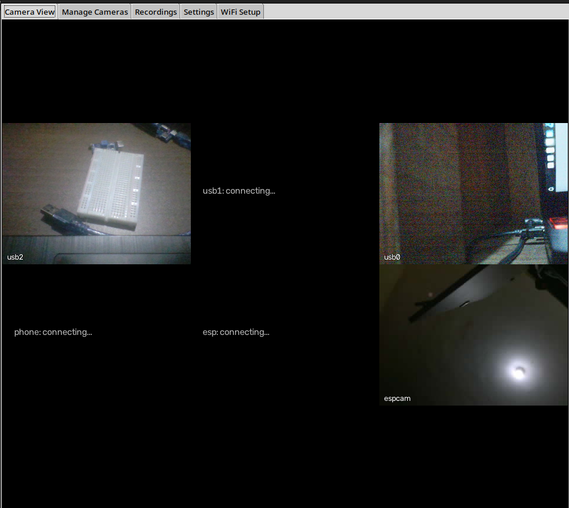

## Why this project

Recently, I've been involved in a lot of camera work relating to imaging. In an effort to replicate a asurveillance system, I designed an application hub for connecting and managing cameras over a network or connected via caable. I got to know that my country doesn't manufacture surveillance systems for commercial use so I thought coming up with one would be cool, instead of depending on foreign products.

## About
 The GUI runs on Python's Tkinter. It is easy to use. You navigate to the "Manage Cameras" Tab and scan for connected cameras. Then you name each one and add it to the main grid. You can toggle video recording and facial recognition features. You could also monitor the video feeds remotely using a private VPN service. 

 I took a brave step trying to deploy the applicaation on a Raspberry Pi 3. The plan was so that the piece of hardware can be used anywhere and so it could be marketable, which is what my boss wants ofcourse. However, the Pi couldn't handle the compute needed, having only 1 GB of RAM

## Current status / what's next
After a failed deployment, though i learnt a lot from working with a raspberry, i reverted back to the old architecture, a python application. I intend on adding AI analytics and assistance(i'd call her Eva), for example "Hey Eva, did you see a red car today? " "Hey Eva, Describe yesterday's activities". I also plan to use this experience to develop spy camera systems. 

